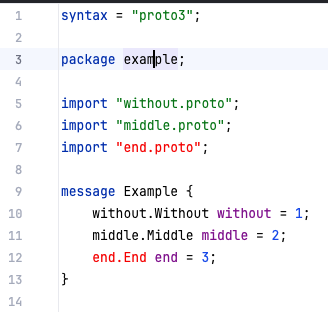

# protobuf-plugin-bug

This repository is created to provide the example for the bug https://github.com/devkanro/intellij-protobuf-plugin/issues/252.

Plugin version: 2.0.0

Settings can be found in `.idea/protobuf.xml`:
```xml
<?xml version="1.0" encoding="UTF-8"?>
<project version="4">
    <component name="ProtobufSettings">
        <roots>
            <entry path="file://$PROJECT_DIR$/without" />
            <entry path="file://$PROJECT_DIR$/mid~dle" />
            <entry path="file://$PROJECT_DIR$/end~" />
        </roots>
    </component>
</project>
```

There is an unresolved import in `example/example.proto`:


